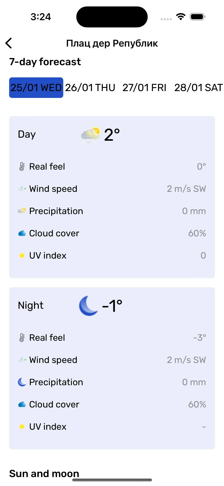

# TheWeatherOutside

|||||
|:-:|:-:|:-:|:-:|

### Used technologies:

#### Architecture:
- VIP

#### UI layer:
- UIKit

#### Network:
- Alamofire

#### Persistence:
- CoreData
- UserDefaults

#### Other:
- CLLocationManager

### Languages:
- English
- Russian
